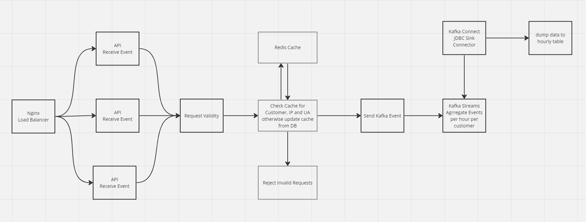
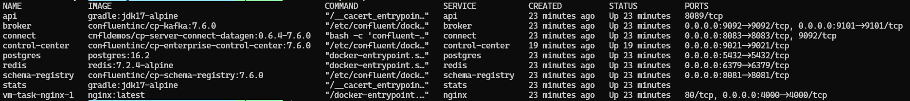

 # Pipeline Overview


# Confusions
1. UserAgent (UA): I took "userId" from json payload as UA if that is not correct then logic is there to extract UA from request and plug that into the logic
2. Hourly Stats: Timestamp in json payload is not a required param thus i attached timestamp as request comes which coulf also be changes if needed

# How to Run
1. Docker installation is prerequisite
2. Run ```docker-compose up -d```, maksure that all the containers are running 
   - if one is going to test it multiple sessions then please uncomment volumes mounts in docker-compose file specially under postgres and broker service so you do not need to test everything from scratch everytime
3. Nginx load balancer is used to handle bursts of requests so please increase 'api' replicas to desired number, currently it is set to 1 which can handle around 10k requests per 4 seconds but eventully it depends on tester hardware resources
4. Post json payload to ```http://localhost:4000/api/log_event``` to make a request
   - i have tried covering all the use cases and return some useful error too
   - this request return 'Block UA' but consider this for hoourly stats: ```{
                        "customerID": 1,
                        "tagID": 2,
                        "userID": "A6-Indexer",
                        "remoteIP": "1.1.1.1",
                        "timestamp": 1500000000
                    }```
5. Get request to get stats (which accepts either date param formatted as 'dd.MM.yyyy' or day params which is 'day of the year')
   - http://localhost:4000/api/stats?customerId=1&date=13.03.2024   or
   - http://localhost:4000/api/stats?customerId=4&day=73 
   ```{
        "customerDayStats": {
            "customerId": 1,
            "request_count": 4,
            "invalid_count": 0
        },
        "dayStats": {
            "request_count": 4,
            "invalid_count": 0
        }
    }```

# Improvements:
1. there are other ways to handle this task too, i do have couple of the solutions let's discuss that in personal meeting
2. api request handling could be improved but i focused on overall pipeline rather writing perfect api 